# 🎯 Wincur
### Professional Telemetry Reset Tool

**A professional Windows application for resetting telemetry data**
**Windsurf** • **Cursor** • **Warp**

### [📥 Download Latest Release](https://github.com/FilippoDeSilva/wincur/releases/latest)

## ✨ Features
...
## 🚀 Quick Start

```mermaid
graph LR
 A[📥 Download] --> B[▶️ Run]
 B --> C[🖱️ Click Tool]
 C --> D[✅ Done!]
 style A fill:#00d4ff,stroke:#333,stroke-width:2px,color:#000
 style B fill:#00d4ff,stroke:#333,stroke-width:2px,color:#000
 style C fill:#00d4ff,stroke:#333,stroke-width:2px,color:#000
 style D fill:#4CAF50,stroke:#333,stroke-width:2px,color:#000
```

